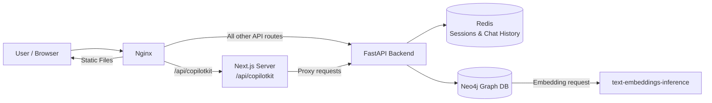
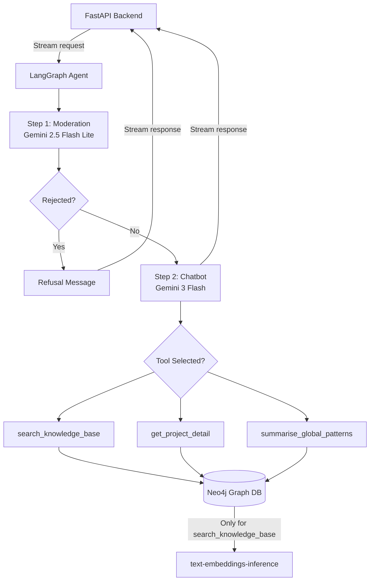

# Interactive Portfolio

A GraphRAG chatbot for interactive portfolio exploration, built with FastAPI, Next.js, and Neo4j.

## System Architecture

```mermaid
flowchart LR
    User[User / Browser]

    Nginx[Nginx]
    NextJS[Next.js Server<br/>/api/copilotkit]
    FastAPI[FastAPI Backend]

    Redis[(Redis<br/>Sessions & Chat History)]
    Neo4j[(Neo4j Graph DB)]
    TEI[text-embeddings-inference]

    %% User entry
    User --> Nginx

    %% Routing
    Nginx -->|Static Files| User
    Nginx -->|/api/copilotkit| NextJS
    Nginx -->|All other API routes| FastAPI

    %% Proxy behavior
    NextJS -->|Proxy requests| FastAPI

    %% Backend dependencies
    FastAPI --> Redis
    FastAPI --> Neo4j

    %% Embedding path
    Neo4j -->|Embedding request| TEI
```

## Agent Architecture

```mermaid
flowchart TD
    FastAPI[FastAPI Backend]

    LangGraph[LangGraph Agent]
    Moderation[Step 1: Moderation<br/>Gemini 2.5 Flash Lite]

    Reject{Rejected?}
    Refusal[Refusal Message]

    Chatbot[Step 2: Chatbot<br/>Gemini 3 Flash]

    ToolSelect{Tool Selected?}

    Tool1[search_knowledge_base]
    Tool2[get_project_detail]
    Tool3[summarise_global_patterns]

    Neo4j[(Neo4j Graph DB)]
    TEI[text-embeddings-inference]

    %% Agent execution
    FastAPI -->|Stream request| LangGraph
    LangGraph --> Moderation

    %% Moderation decision
    Moderation --> Reject
    Reject -->|Yes| Refusal
    Refusal -->|Stream response| FastAPI

    Reject -->|No| Chatbot

    %% Tool decision
    Chatbot --> ToolSelect
    ToolSelect --> Tool1
    ToolSelect --> Tool2
    ToolSelect --> Tool3

    %% Tool DB access
    Tool1 --> Neo4j
    Tool2 --> Neo4j
    Tool3 --> Neo4j

    %% Embedding path (special case)
    Neo4j -->|Only for search_knowledge_base| TEI

    %% Normal response streaming
    Chatbot -->|Stream response| FastAPI
```
